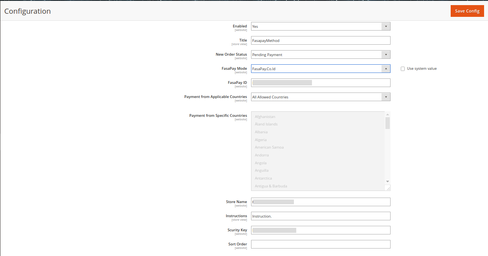

## FasaPay E-Payent Gateway
---
FasaPay ePayment module untuk MAGENTO version 2.X.X
### PROSES INSTALASI
---
1. Download module FasaPay ePayment
2. Copy file kedalam folder Peojek_Magento_anda/app/code/
3. Selanjutnya aktifkan module

> **Comand Line**
>> Buka terminal
<br /> Masuk kedalam folder projek magento anda
<br /> <pre>
        bin/magento module:enable --clear-static-content FasaPaymentSci_Fasapay
    </pre>

> **Manual**
>> Edit file app/etc/config.php
<br /> Pada file ini setiap module memiliki value 1 dan 0 
    <br />- 1 artinya module enable
    <br />- 0 artinya module disable
<br /> Edit value module FasaPaymentSci_Fasapay menjadi 1
>> <pre> 
        array 
        .......
            'FasaPaymentSci_Fasapay' => 1,
            'Magento_CheckoutAgreements' => 1,
            'Magento_Payment' => 1,
            'Magento_SampleData' => 1,
            'Magento_CmsUrlRewrite' => 1,
            'Magento_Config' => 1,
            'Magento_ConfigurableImportExport' => 1,
            'Magento_Downloadable' => 1,
            'Magento_Wishlist' => 1,
        .....
        ),
    </pre>

4. Seting pembayaran <br />
```
   STORES -> Configuration -> Sales -> PaymentMethod -> Other Payment Method -> Fasapay
```

  + Fasapay Mode
  + Fasapay Id
  + Store Name
  + Scurity Key

